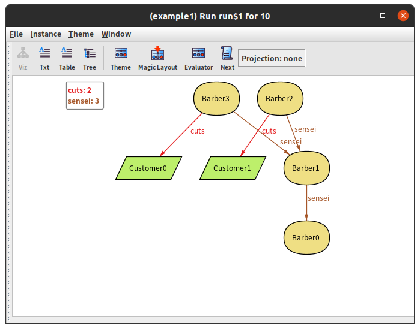
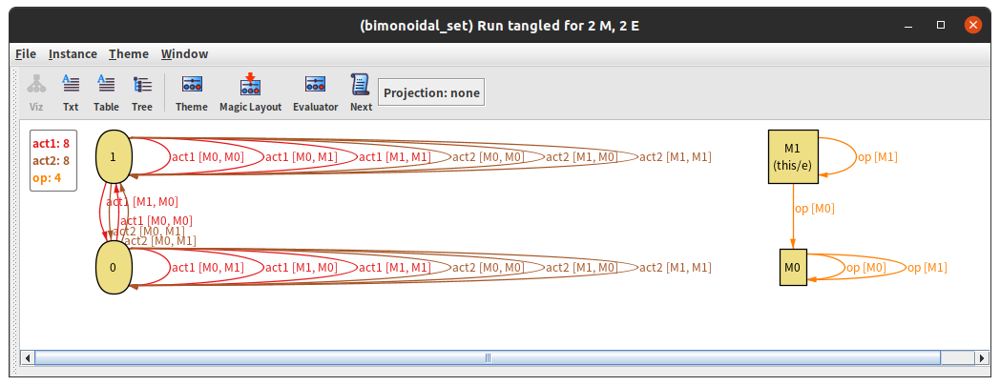
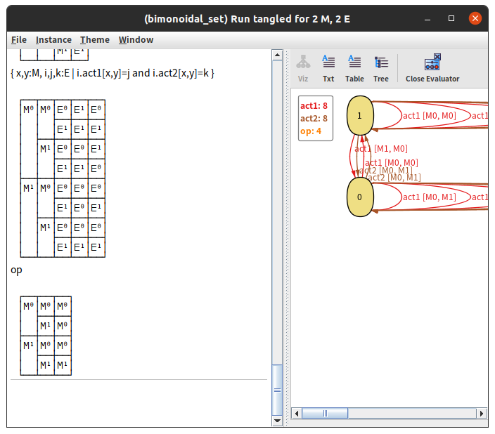

※[前回の記事](2020-05-30-applicatives.html)の続きです

# 反例発見

前回の記事にこんなことを書きました。

> 関手`F x ~ (M, E -> x)`に対するすべての可能なApplicativeのインスタンスは、両側モノイド作用によるものか？

反例があったので違います。

```haskell
-- モノイドMは(Bool, True, (&&))
type M = Bool
(<>) = (&&)
mempty = True

-- Eへの作用は以下の通り。一つのモノイド作用だけで書けないが、
-- 法則はすべて満たしている。
type E = Bool
d :: M -> M -> E -> (E,E)
d x y i  = (y && i, i && (x || not x && not y))
```

# どうやって見つけたのか

前回から1月以上もたっていますが、別にその間たくさん試行錯誤したわけではなく（ゲームばっかりしていた）、[Alloy Analyzer](http://alloytools.org/)というモデル探索ツールを使いました。

このツールは、Alloyという言語で書かれた仕様に対して、その仕様を満たすような具体的なモデルを見つけてくれるというものです。このAlloyという言語で作るモデルは、オブジェクトとそのあいだの関係を基本的な要素として組み立てられます。

仕様の例はこんな感じになります：

```
// 床屋オブジェクト
sig Barber {
	// たかだか一人の師匠がいる
	sensei : lone Barber,
	// たかだか一人の客の髪を切っている
	cuts : lone Customer
}
// 客オブジェクト
sig Customer {}

// 師弟関係は木になっている
fact OneFounder { one b : Barber | no b.sensei }
fact NoTimeParadox { no b : Barber | b in b.^sensei } // ^e でeの推移閉包が取れる

// どの客もちょうど一人の床屋に切ってもらっている
fact NoWaitingCustomer { all c : Customer | one c.~cuts } // ~e でeの逆関係が取れる

// 床屋bは仕事している？
pred working[b : Barber] { some b.cuts }

// 師匠が仕事をしているなら弟子は休めない
fact Hardship { all b : Barber | working[b.sensei] implies working[b] }

// Customerが2人, Barberが4人のモデルを探索
run {} for exactly 2 Customer, exactly 4 Barber
```

この仕様に対して、次の画像のようなモデルを作ってくれます：



Alloy Analyzerは、裏でSATソルバーなどを使って、制約を満たすモデルを見つけてくれます。しかし、重要なことは、「モデルが見つからなかった」ことと「モデルが存在しない」ことが違うということです。サイズの大きいモデルしか無ければ、探している範囲にモデルが無いこともありますし、単に探索に失敗することもあります。その代わり、このソフトは定理自動証明よりはるかに手軽です。

今回考えていた疑問は、「すべての......という制約を満たす集合と演算は、......という性質を自動的に持つか？」という形でした。もし簡単な反例があるなら、Alloy Analyzerに「......という制約を満たす集合と演算で、......という性質を**持たない**」のモデルを探させて、見つかればそれでよいと考えたわけです。

ここで、「......という制約を満たす集合と演算で、......という性質を**持つ**」のモデルを探させることに特に意味がないことには注意してください。

最終的に、こんな仕様を書くと反例が見つかりました。

```
sig M {
	op : M -> one M
}
one sig e in M {}

fact { all x:M | op[e,x] = x }
fact { all x:M | op[x,e] = x }
fact { all x,y,z:M | op[op[x,y],z] = op[x,op[y,z]] }

pred group { all x : M | { one y : M | op[x,y] = e } }

sig E {
	act1 : M -> M -> one E,
	act2 : M -> M -> one E
}
fact { all x:M, i:E | act2[i][e,x] = i }
fact { all x:M, i:E | act1[i][x,e] = i }
fact { all x,y,z:M, i:E |
	i.act1[op[x,y],z].act1[x,y] = i.act1[x,op[y,z]]
}
fact { all x,y,z:M, i:E |
	i.act2[op[x,y],z] = i.act2[x,op[y,z]].act2[y,z]
}
fact { all x,y,z:M, i:E |
	i.act1[op[x,y],z].act2[x,y] = i.act2[x,op[y,z]].act1[y,z]
}

pred tangled {
	let untangle1 = all x:M, i:E | one i.act1[M,x],
		untangle2 = all x:M, i:E | one i.act2[x,M]
	{ not (untangle1 and untangle2) }
}

run tangled for 2 M, 2 E
```

見つかったものは・・・



はい、わかりません。幸い、見やすい表で出すこともできたので大丈夫でした。



