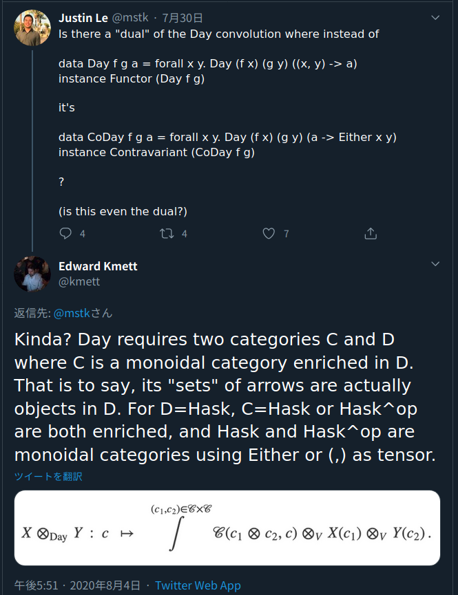

<a href="https://twitter.com/kmett/status/1290570997439971329">

</a>

## Applicativeも単なる自己関手の圏での（略）何か問題でも？

Day convolutionという言葉は、
Haskellに圏論を持ち込む勢をフォローしていないとあんまり耳にしないかと思います。

何かというと、既にお約束の内輪ネタみたいになってしまったフレーズ

> モナドは単なる自己関手の圏におけるモノイド対象だよ。何か問題でも？

的な物言いを、「[Applicativeに対してもArrowに対してもできるよ](https://www.fceia.unr.edu.ar/~mauro/pubs/Notions_of_Computation_as_Monoids.pdf)」
という論文で道具として使っている、圏論由来のナニモノかです。これによると、

> Applicativeは単なる自己関手の圏――にDay convolutionを入れてモノイド圏にしたもの――におけるモノイド対象だよ。何か問題でも？

です。

ちょっとここで断らせてほしいのですが、以下、「モナドは単なる……何か問題でも？」
が意味するところは既に知っている方を想定読者にさせてください。でないと、延々と圏論の解説が必要になってしまうので。

その論文でApplicativeのために使ったDay convolutionは、
Haskell的には次のように定義されます。

```haskell
data Day f g c where
    MkDay :: ((a,b) -> c) -> f a -> g b -> Day f g c

instance Functor (Day f g) where
    fmap :: (c -> c') -> Day f g c -> Day f g c'
    fmap f (MkDay abc fa gb) = MkDay (f . abc) fa gb

type I a = () -> a
```

ここで、`f`と`g`は`Functor`だと思ってください。そうするとき、
型コンストラクタ`Day`は`Functor`ふたつをとって`Functor`を作り出す、
`Functor`上の二項演算と見ることができます。これはちょうど、
`(,)`が型ふたつをとって型を作り出す二項演算と見ることができるようなものです。

そして、`(,)`のように、`Day`は`Functor`のなす圏でのモノイド積としての性質を持ちます。（証明は省きます。）
"モノイド積"というからには単位対象があり、`type I a = () -> a`（すなわち`()`を引数にとる関数を`Functor`とみなしたもの）
がそうです。

この`I`は [Identity](https://hackage.haskell.org/package/base-4.14.0.0/docs/Data-Functor-Identity.html)
と同型なので、特に`() -> a`とする必要がないように思うかもしれません。
後から一般化するための布石ですので、今は気にしないでください。

さて、ある`f :: Type -> Type`が`Applicative`であるなら、
`f`は関手圏に`Day`と`I`でモノイド積をいれたモノイド圏におけるモノイド対象です。

```haskell
type (~~>) f g = forall x. f x -> g x

mult :: (Applicative f) => Day f f ~~> f
mult :: (Applicative f) => forall c. Day f f c -> f c
mult (MkDay abc fa gb) = liftA2 (curry abc) fa gb

unit :: (Applicative f) => I ~~> f
unit :: (Applicative f) => forall c. (() -> c) -> f c
unit i = pure (i ())
```

逆に、`mult` と `unit`が先に与えられても`liftA2`と`pure`がそこから定義でき、
`mult`と`unit`がモノイドになる（結合則、単位則）ならば`Applicative`則を満たします。

モナドも自己関手の圏に*関手の合成でモノイド積を入れたもの*におけるモノイド対象だったので、
モナドも`Applicative`も"適切に選んだモノイド圏でのモノイド対象"という書き方ができます。
うれしいね、というのがこの論文で`Day`が持ち出された理由でした。

## Alternativeも（略）何か問題でも？

Day convolutionというのはなにも上に挙げた形のものだけでなく、

* ある圏*C*からHaskへの関手 *C*->Hask のなす圏で
* *C*上の任意のモノイド積に対して

構成できる、関手圏 *C*->Hask 上のモノイド積でもあります。

（当然、数学するときはHask以外の関手の行き先になれる圏(Setsとか)を考えるのですが、
今はおいときます。）

`Applicative`に使ったものは、関手圏　Hask->Hask（`Functor`の自然変換たちの圏）で、
Hask上のモノイド積`(,)`とその単位`()`から作ったDay convolutionでした。

もはやHaskellではない疑似コードですが、
一般に、あるモノイド圏(*C*, ⊗, 1)からHaskへの関手圏で考えたDay convolutionは

```haskell
data Day(C,⊗) f g c where
    -- C(-,-)は圏CのHom
    -- 言ってなかったけれども、HomはHaskellの型だと思っているので
    --   C(-,-) :: Type
    MkDay :: C(a ⊗ b, c) -> f a -> g b -> Day(C,⊗) f g c

type I a = C(1, a)
```

です。

今度はHask上の別のモノイド積`Either`とその単位`Void`からDay convolutionを作ってみます。

```haskell
data Day_E f g c where
    MkDay :: (Either a b -> c) -> f a -> g b -> Day f g c
type I a = Void -> a
```

`(,)`と`()`から作ったときのように、モノイド単位`I`はもっと単純な[Proxy](https://hackage.haskell.org/package/base-4.14.0.0/docs/Data-Proxy.html)と同型です。
今回はさらに、`Day_E f g`のほうももっと単純なものに同型です。

```haskell
Day_E f g c
  ~ ∃a b. (Either a b -> c, f a, g b)
  ~ ∃a b. (a -> c, b -> c, f a, g b)
  ~ (∃a. (a -> c, f a),  ∃b. (b -> c, g b))
  ~ (f c, g c)   -- CoYoneda
```

`Applicative`のときと同じように、モノイド対象が何なのか考えると、

```haskell
-- mult :: Day_E f f ~~> f
-- mult :: forall c. (f c, f c) -> f c
mult :: f c -> f c -> f c

-- unit :: I ~~> f
-- unit :: forall c. (Void -> c) -> f c
-- unit :: Proxy c -> f c
unit :: f c
```

これは単なる`Alternative`ですね……といっても、
`Alternative`は`Applicative`のサブクラスで、
`Applicative`との関係をきめる法則が要求されることもあるので、
`Alternative`は単にモノイド対象だよ、とは言いがたいですけどね。

<div class='sidenote'>
（余談）誰もが納得する、共通認識としての`Alternative`則なるものは*ない*です。
私は初めて知ったときはビビりました。
一応、`(<|>)`と`empty`がモノイドになることぐらいはほぼ前提と思っていいですが、
`Applicative`との関係は[すごく微妙です](https://wiki.haskell.org/Typeclassopedia#Failure_and_choice:_Alternative.2C_MonadPlus.2C_ArrowPlus)。

個人的には、
`Alternative`のサブクラスを2つか3つ定義して、それぞれ目的にあった法則を与えたほうがよいと考えています。
例えば、パーサとして期待する法則をもつ`Parsing`クラスを定義して、`many`なんかはそっちに移管するなど。
大本の`Alternative`直接使用をdeprecatedにまでできれば心が安らぎます。
ApplicativeをMonadの上に差し込むときを考えても、3年ぐらいかければ可能だと思います。
</div>

## Contravariantでも考えるぞ

[Contravariant](https://hackage.haskell.org/package/base-4.14.0.0/docs/Data-Functor-Contravariant.html)は、
HaskからHaskへの反変関手です。言い換えれば、Hask<sup>op</sup>からHaskへの関手です。

反対圏をとっても、モノイド積は変わりません。
それらを使ったDay convolutionも考えていきます。

```haskell
-- Hask^opの射
-- 本当は <- っていう識別子は使えないけど許して
type a <- b = b -> a

data DayOp f g c where
    MkDay :: ((a,b) <- c) -> f a -> g b -> DayOp f g c

instance Contravariant (DayOp f g) where
    contramap :: (c <- c') -> DayOp f g c -> DayOp f g c'
    contramap f (MkDay abc fa gb) = MkDay (abc . f) fa gb

type I a = () <- a
```

`f`, `g`, `DayOp f g`がどれも`Contravariant`である場合を考えているのに注意です。

モノイド対象はどんな演算を持つでしょうか？

```haskell
-- mult :: DayOp f f ~~> f
-- mult :: forall a b c. ((a,b) <- c) -> f a -> f b -> f c
mult :: forall a b c. (c -> (a,b)) -> f a -> f b -> f c

-- unit :: I ~~> f
-- unit :: forall c. (() <- c) -> f c
-- unit :: forall c. Proxy c -> f c
unit :: f c
```

これも実はすでに存在する型クラス[Divisible](https://hackage.haskell.org/package/contravariant-1.5.2/docs/Data-Functor-Contravariant-Divisible.html#t:Divisible)に相当します。
ekmett氏のライブラリなだけあって、このページで説明しているような理論的背景もざっくりとドキュメントに書いてあります。

Hask<sup>op</sup> で `Either`と`Void`のモノイドを考えた場合にあたる[Decidable](https://hackage.haskell.org/package/contravariant-1.5.2/docs/Data-Functor-Contravariant-Divisible.html#t:Decidable)も同じライブラリにありますね。

もっとバリエーションがあるかもしれません。Bifunctorなら？Profunctorなら？Higher-Kinded Data ((Hask->Hask)->Hask) なら？

まだ見ぬ有用なクラスが眠っているかもしれないとちょっと思っています。
